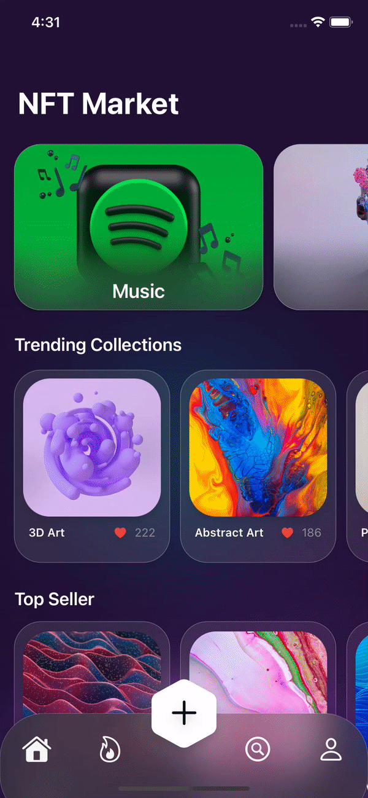
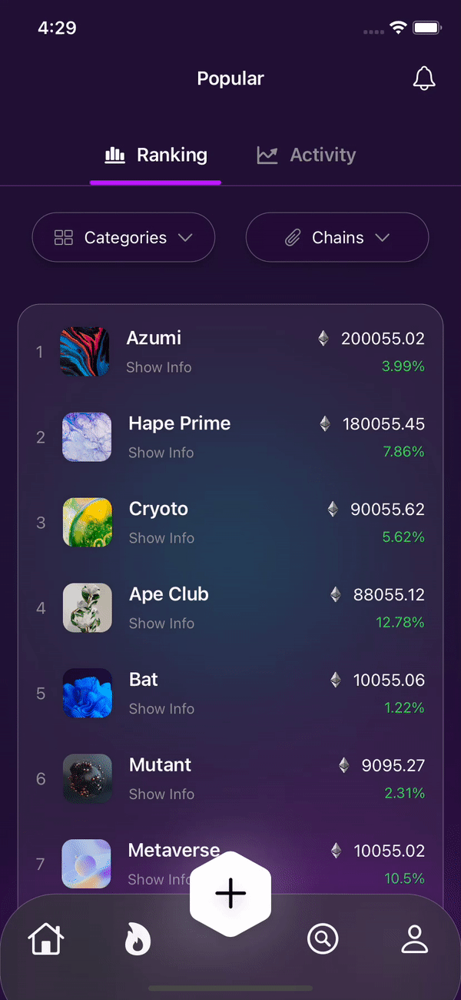

# NFTApp 

**Developed from a Figma design, special thanks to Aksonvady Phomhome, @aksondesign and DesignCode **

  

## Architecture
- SwiftUI and MVVM
- Custom Components Embracing the **Glassmorphism** Design Style 
- Fully Adjustable Custom Tab Bar
- Clean Structure with Reusable Components
- Beautiful Animations and Smooth Transitions

 
# NFTApp - Showcase

        

